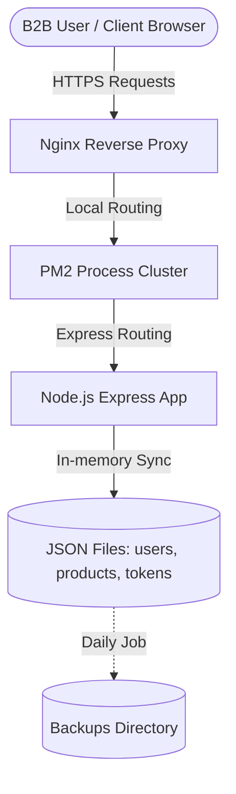

# Architecture Guide — Koshda B2B Jewellery Platform

This document describes the software design, structure, and structural components of the Koshda B2B platform.

---

## 🏗️ 1. Component Topology

The architecture uses a classic client-server model consisting of:
- **Client (Frontend):** Pure HTML templates located in `/admin` (admin control centre) and `/public` (dealer and landing pages). Styling is controlled via vanilla CSS, and state management uses sessionStorage and localStorage.
- **Server (Backend API):** Hardened Node.js/Express server containing all security, authentication, and core business logic inside `backend/server.js`.
- **Database (Data Persistence Layer):** Currently structured as in-memory data representations loaded and synced to physical JSON files inside `backend/data/` (users, products, requests, tokens). *In Phase 2, this layer will migrate to PostgreSQL.*

---

## 👥 2. Role-Based Access Control (RBAC) Architecture

The platform defines strict access permissions per administrative tier:

| Role | Permissions | Description |
| :--- | :--- | :--- |
| **`super_admin`** | `admin.login`, `admin.read`, `admin.write`, `admin.delete`, `admin.manage_users` | Full structural and administrative command over the application. |
| **`admin`** | `admin.login`, `admin.read`, `admin.write` | Operational controls (managing requests, creating products). |
| **`catalogue_manager`** | `admin.login`, `admin.read`, `admin.write` | Specialized roles to edit catalog, upload bulk templates. |
| **`dealer_manager`** | `admin.login`, `admin.read`, `admin.write` | Customer relationships, onboarding, and device approvals. |
| **`analytics_viewer`** | `admin.login`, `admin.read` | Read-only access to audit logs, registration counters, metrics. |
| **`viewer`** | `admin.login` | Read-only preview state. |

---

## 🔄 3. Core Data Flow Workflows

### 🛡️ Admin Gate Authentication Workflow
1. User requests `/:secret_path` (dynamic admin gateway url).
2. Middleware validates path is correct (`CONFIG.ADMIN_SECRET_PATH`).
3. Serving logic checks for the `admin_token` cookie.
   - **Valid Token:** Redirects user to dashboard page.
   - **No Token:** Serves `admin-access.html` secure key gate form.
4. User submits the Secret Key.
5. Backend verifies code in constant-time (HMAC Timing-Safe check).
6. On success:
   - Sets HTTP-Only secure cookie (`admin_token`).
   - Registers audit log entry (`logs/admin.log`).
   - Redirects to Admin Dashboard.

### 📦 Product Data Catalog Synchronization
- **Read Path:** Direct, cached in-memory retrieval of the products array. When a client calls `/api/products`, the server parses the request page constraints and returns slices instantly from the loaded array (zero file system read latency).
- **Write Path:** Additions or bulk CSV uploads write the new product elements to the in-memory cache and immediately call `fs.writeFileSync()` on the source files to maintain physical synchronization.
